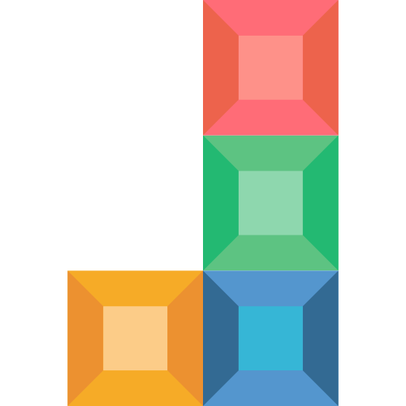

# Tetris Co-op

<div align="center">
  
  
  **A modern multiplayer Tetris game with real-time collaboration and competitive features**
  
  [](https://opensource.org/licenses/MIT)
  [](https://www.typescriptlang.org/)
  [](https://reactjs.org/)
  [](https://socket.io/)
</div>

## 🌟 Demo

https://huy-lv.github.io/tetris

## 🌟 Features

### 🎮 Core Gameplay

- **Classic Tetris Mechanics**: Full implementation of standard Tetris rules with wall kicks, ghost pieces, and hold functionality
- **Real-time Multiplayer**: Play with friends in real-time using Socket.IO
- **Room-based System**: Create or join rooms with unique codes for private games
- **Cross-platform**: Works on desktop and mobile devices

### 🚀 Advanced Features

- **Garbage Row System**: Clear lines to send garbage rows to opponents
- **Fireball Effects**: Visual fireball animations when sending garbage
- **AI Bot**: Built-in Tetris AI for single-player practice (not ready yet)
- **Sound Effects**: Immersive audio with customizable settings
- **Responsive Design**: Optimized for both desktop and mobile play

### 🎯 Competitive Elements

- **Real-time Leaderboards**: See other players' progress during the game
- **Garbage Attack**: Strategic line clearing to pressure opponents
- **Winner Detection**: Automatic game over detection and winner announcement
- **Reconnection Support**: Automatic reconnection if connection is lost

### ⚙️ Customization

- **Customizable Controls**: Remap keys to your preference
- **Animation Settings**: Toggle various visual effects
- **Audio Settings**: Control sound effects and volume
- **Theme Support**: Modern dark theme with gradient backgrounds

## 🚀 Getting Started

### Prerequisites

- **Node.js** (v16 or higher)
- **Yarn** package manager
- **Git**

### Installation

1. **Clone the repository**

   ```bash
   git clone https://github.com/yourusername/tetris-coop.git
   cd tetris-coop
   ```

2. **Install dependencies**

   ```bash
   # Install root dependencies
   yarn install

   # Install client dependencies
   cd client
   yarn install

   # Install server dependencies
   cd ../server
   yarn install
   ```

3. **Start development servers**

   ```bash
   # Terminal 1: Start the backend server
   cd server
   yarn dev

   # Terminal 2: Start the frontend client
   cd client
   yarn dev
   ```

4. **Open your browser**
   Navigate to `http://localhost:5173` to start playing!

## 🎮 How to Play

### Single Player Mode

- Use arrow keys to move and rotate pieces
- Hold `J` for hard drop
- Press `B` to hold pieces
- Clear lines to increase your score

### Multiplayer Mode

1. **Create a Room**: Click "Create Room" to generate a unique room code
2. **Share the Code**: Share the room code with friends
3. **Join Together**: Friends can join using the room code
4. **Start Playing**: Once everyone joins, start the game
5. **Compete**: Clear lines to send garbage rows to opponents

### Controls

- **W A S D**: Move pieces left/right/down
- **N**: Rotate clockwise
- **J**: Hard drop
- **B**: Hold piece

## 🏗️ Project Structure

```
tetris-coop/
├── client/                 # Frontend React application
│   ├── src/
│   │   ├── components/     # React components
│   │   ├── hooks/         # Custom React hooks
│   │   ├── services/      # API and Socket.IO services
│   │   ├── pages/         # Page components
│   │   ├── utils/         # Utility functions
│   │   └── types/         # TypeScript type definitions
│   └── package.json
├── server/                # Backend Node.js server
│   ├── src/
│   │   ├── index.ts       # Main server file
│   │   ├── constants.js   # Server constants
│   │   └── utils.js       # Server utilities
│   └── package.json
├── .github/               # GitHub Actions workflows
└── README.md
```

## 🛠️ Development

### Available Scripts

**Client (React)**

```bash
cd client
yarn dev          # Start development server
yarn build        # Build for production
yarn typecheck    # Run TypeScript type checking
yarn lint         # Run ESLint
```

**Server (Node.js)**

```bash
cd server
yarn dev          # Start development server with nodemon
yarn build        # Build TypeScript to JavaScript
yarn start        # Start production server
```

### Technology Stack

- **Frontend**: React 18, TypeScript, Material-UI, Socket.IO Client
- **Backend**: Node.js, Express, Socket.IO, TypeScript
- **Build Tools**: Vite, TypeScript Compiler
- **Package Manager**: Yarn
- **Deployment**: GitHub Actions, Docker

## 🚀 Deployment

### Using Docker

1. **Build the Docker image**

   ```bash
   docker build -t tetris-coop .
   ```

2. **Run the container**
   ```bash
   docker run -p 3000:3000 tetris-coop
   ```

### Manual Deployment

1. **Build the client**

   ```bash
   cd client
   yarn build
   ```

2. **Build the server**

   ```bash
   cd server
   yarn build
   ```

3. **Start the server**
   ```bash
   cd server
   yarn start
   ```

## 🤝 Contributing

We welcome contributions! Please read our contributing guidelines:

1. **Fork the repository**
2. **Create a feature branch** (`git checkout -b feature/amazing-feature`)
3. **Commit your changes** (`git commit -m 'Add some amazing feature'`)
4. **Push to the branch** (`git push origin feature/amazing-feature`)
5. **Open a Pull Request**

### Development Guidelines

- Follow TypeScript best practices
- Use strict TypeScript configuration
- Write meaningful commit messages
- Test your changes thoroughly
- Follow the existing code style

## 🐛 Issues & Support

If you encounter any issues or have questions:

1. **Check existing issues** on GitHub
2. **Create a new issue** with detailed information
3. **Join our discussions** for general questions

## 📄 License

This project is licensed under the MIT License - see the [LICENSE](LICENSE) file for details.

## 🙏 Acknowledgments

- **Tetris Company** for the original Tetris game concept
- **React Team** for the amazing frontend framework
- **Socket.IO Team** for real-time communication
- **Material-UI Team** for the beautiful component library
- **All contributors** who helped make this project possible

## 📊 Project Stats


---

<div align="center">
  Made with ❤️ by the HuyLV
  
  [Website](https://huy-lv.github.io/tetris) • [Telegram](https://t.me/huylvz)
</div>
